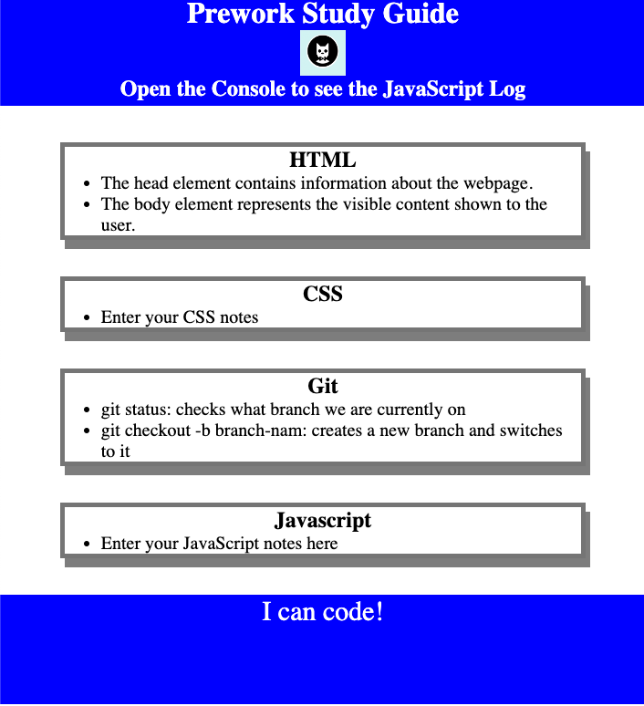

# prework-study-guide

Prework repository for bootcamp

# <Study Guide Webpage>

## Description

Hope to get out of 'the programming beginner' to the next level after completing this course.
In this project, I relearned HTML/CSS/JS for the basics.

## Table of Contents (Optional)

- [Installation](#installation)
- [Usage](#usage)
- [Credits](#credits)
- [License](#license)

## Installation

N/A

## Usage

## Credits

N/A

## License

Please refer to the LICENSE in the repo
